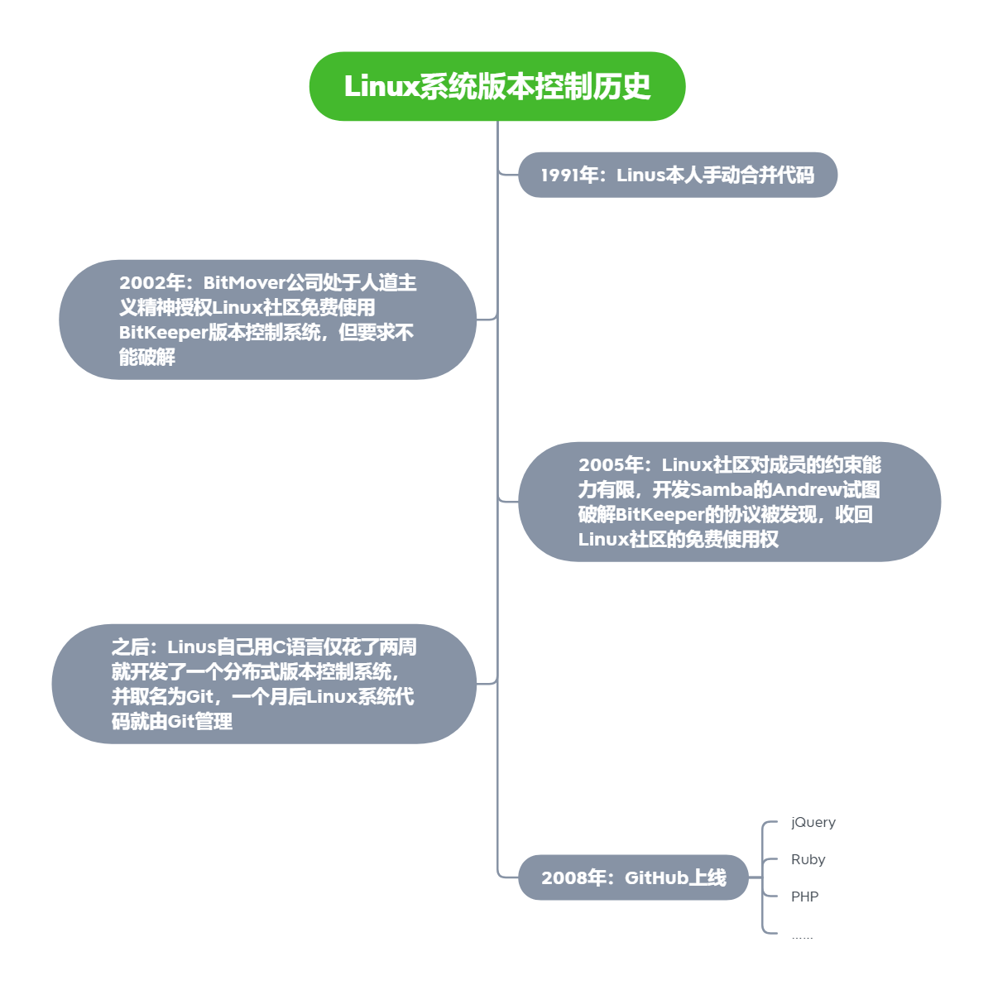
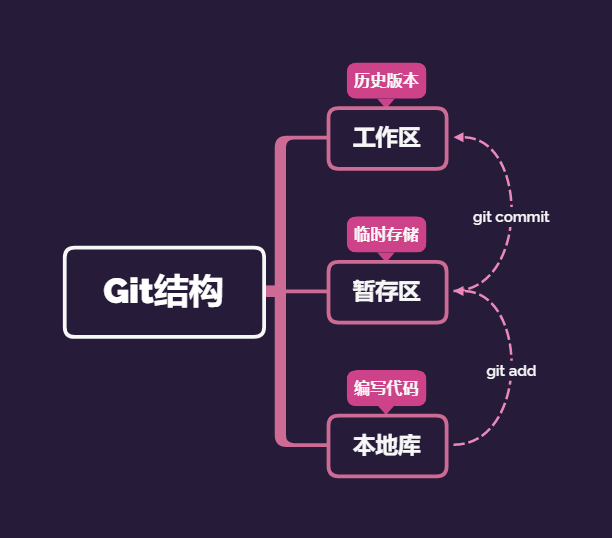
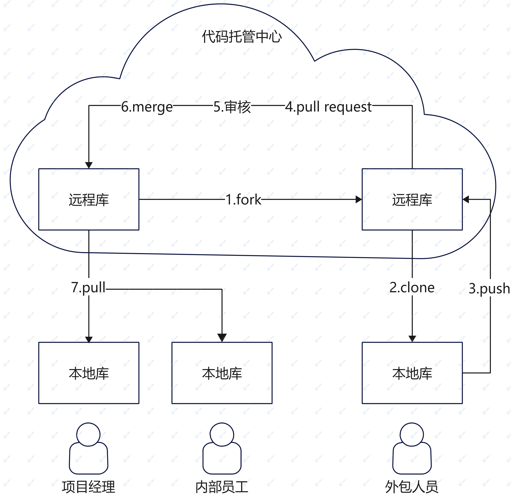

# Git&GitHub

## 版本控制

### 简介

工程设计领域中使用版本控制管理工程蓝图的设计过程，在 IT 开发过程中也可以使用版本控制思想管理代码的版本迭代。无论是个人开发改进迭代，还是团队协作开发，版本控制都具有重要意义。

### 工具

1. 版本控制工具应该具备哪些功能？

   - 协同修改
     - 多人并行不悖的修改服务器端的同一个文件
   - 数据备份
     - 不仅保存目录和文件的当前状态，还能够保存每个提交过的历史状态
   - 版本管理
     - 在保存过的每个版本要做到不保存重复数据，节约存储空间，提高效率。SVN 采用的是增量式管理的方式，而 Git 采取了文件系统快照的方式
   - 权限控制
     - 对团队中参与开发的人员进行权限控制
     - 对团队外开发者贡献的代码进行审核（Git 独有）
   - 历史记录
     - 查看修改人，修改时间、修改内容和日志信息
     - 将本地文件恢复到某个历史状态
   - 分支管理
     - 允许开发团队在工作过程中多条生产线同时推进任务，进一步提高效率

2. 版本控制工具的分类
   - 集中式版本控制工具：CVS, **SVN**, VSS……
   - 分布式版本控制工具：**Git**, Mercurial, Bazaar, Dars……

分布式版本控制工具相比集中式版本控制工具能够很多的避免**单点故障**。

#### Git

1. Git 的发展历史

2. Git 的优势

   - 大部分操作在本地完成,不需要联网
   - 完整性保证(hash)
   - 尽可能添加数据而不是删除或修改数据
   - 分支操作非常快捷流畅
   - 与 linux 命令全面兼容

3. Git 安装

> [https://git-scm.com/](https://git-scm.com/)

4. Git 结构

1. Git 和代码托管中心
   - 局域网环境
     - GitLab 服务器（自己就能搭建）
   - 公网的环境
     - GitHub
     - Gitee

代码托管中心的任务是维护远程代码库。

6. 本地库和远程库
   - 团队内协作
   - 跨团队协作

## Git 命令行操作

### 本地库操作

`git init`（初始化一个空的 Git 仓库，生产一个 .git 目录）

形式：

- 用户名
- 邮箱

作用

用于区分不同开发人员的身份。==这里设置的签名和远程库的账号和密码没有任何关系。==

命令

- 项目级别/仓库级别：
  - git config user.name tom
  - git config user.email test@example.com
- 系统用户级别
  - git config --global user.name tom
  - git config --global user.email test@example.com

优先级

项目级别>系统用户级别（两者必须要有一个）

项目级别配置信息保存在 `./.git/config` 文件里面
系统级别配置信息保存在 `/c/users/xxx/.gitconfig` 文件里面

查看状态：git status

添加文件：git add <file> | git rm --cached <file>

### 远程库操作

## Git 图形化界面操作

## Gitlab 服务器环境搭建

## 参考

> [【尚硅谷】Git 与 GitHub 基础全套完整版教程（快速上手，一套搞定）](https://www.bilibili.com/video/BV1pW411A7a5)
